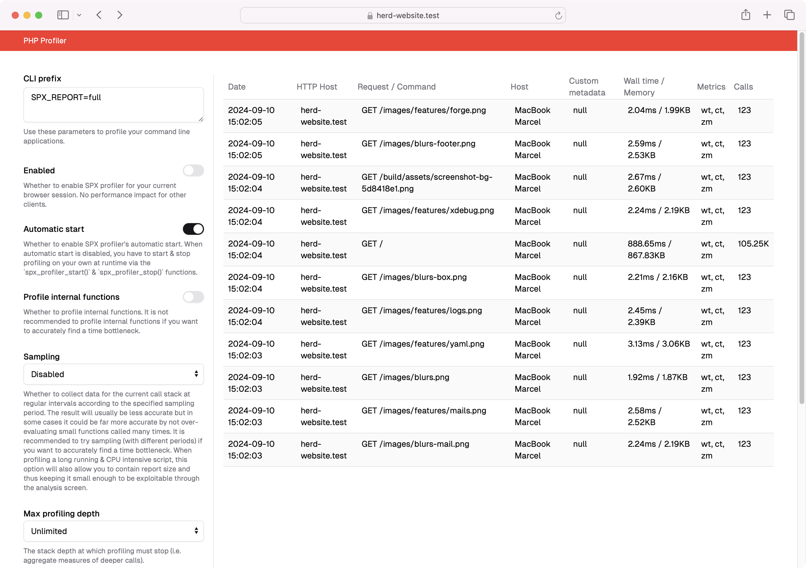
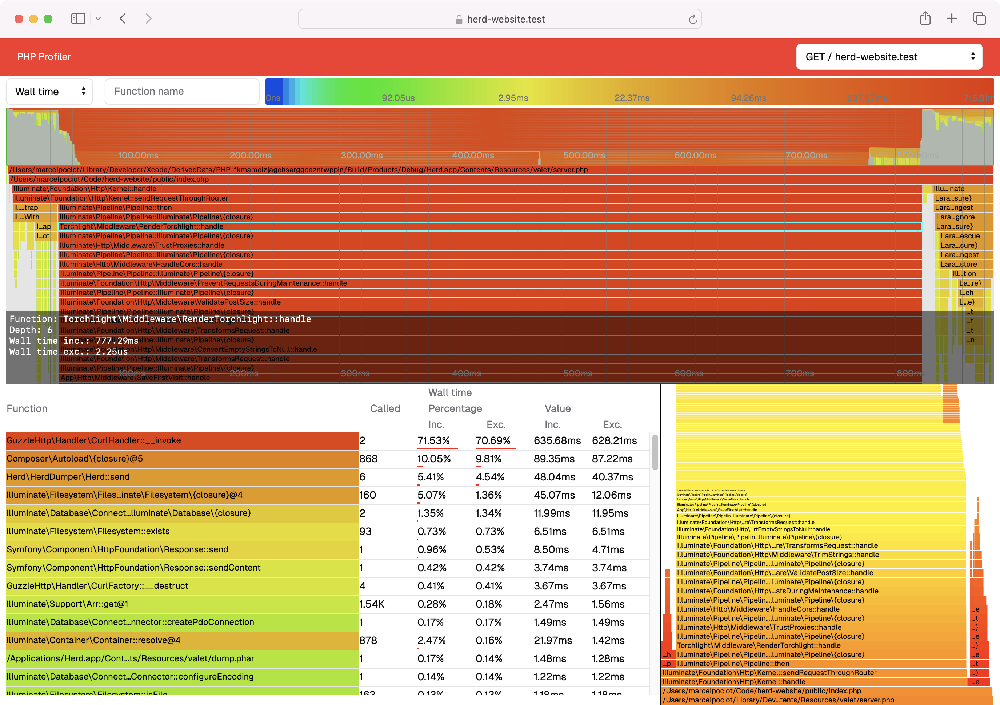

# SPX - A simple profiler for PHP (Herd version)

[![License][:badge-license:]][:link-license:]


This is a fork of the [PHP SPX](https://github.com/NoiseByNorthwest/php-spx) extension with a modernized and modified user interface.

Most importantly, the user interface looks more modern by making use of TailwindCSS and shadcn UI components:





## Installation

If you are using [Laravel Herd](https://herd.laravel.com), the easiest way to install the extension for all available PHP versions is by making use of our installer script:

```
/bin/bash -c "$(curl -fsSL https://raw.githubusercontent.com/beyondcode/php-spx/HEAD/install.sh)"
```

## License

**SPX** is open source software licensed under the GNU General Public License (GPL-3).
See the [LICENSE][:link-license:] file for more information.

<!-- All external links should be here to avoid duplication and long lines with links -->
[:badge-ci:]:           https://github.com/NoiseByNorthwest/php-spx/actions/workflows/main.yml/badge.svg
[:link-ci:]:            https://github.com/NoiseByNorthwest/php-spx/actions/workflows/main.yml

[:badge-php-versions:]: https://img.shields.io/badge/php-5.4--8.4-blue.svg
[:badge-supported-platforms:]: https://img.shields.io/badge/platform-GNU/Linux%20|%20macOS%20|%20FreeBSD%20-yellow
[:badge-supported-arch:]: https://img.shields.io/badge/architecture-x86--64%20|%20ARM64%20-silver

[:badge-license:]:      https://img.shields.io/github/license/NoiseByNorthwest/php-spx
[:link-license:]:       https://github.com/NoiseByNorthwest/php-spx/blob/master/LICENSE
